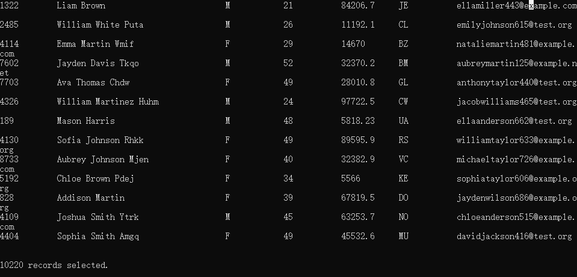

# 一个简易的数据库引擎

一个简易的数据库引擎，支持创建、删除表，插入、选择和删除记录，创建和删除索引等等；

## 测试

test文件夹中包含8个sql文件，test1-7包含一些简单的sql语句，主要测试minisql的细节是否有误；

employee.sql包含10000多条语句，验证minisql在这样的数据量下是否会崩溃，结果是虽然插入较慢，但是并没有报错或者闪退




## 功能

- 创建表

```sql
Input:
create table t1
(
id int ,
name char(20) unique,
age int ,
salary float,
primary key(id)
);

Output:
Create index of id in tablet1 successfully
Successfully create table t1 .
```

- 插入记录

```sql
Input:
insert into t1 values(2,'Kate',24,1800.00);
insert into t1 values(3,'John',34,4000.00);
insert into t1 values(4,'Marry',20,3000.00);
insert into t1 values(5,'Tom',24,1850.00);
insert into t1 values(6,'Queen',28,24000.00);
insert into t1 values(7,'Porry',17,1000.00);
insert into t1 values(8,'Green',24,8000.00);
insert into t1 values(8,'Jim',20,4000.00);
insert into t1 values(9,'Green',22,4000.00);

Output:
Insert 1 record.
Insert 1 record.
Insert 1 record.
Insert 1 record.
Insert 1 record.
Insert 1 record.
Do not allow duplicate values of id in Table t1
Do not allow duplicate values of name in Table t1
```

- 选择语句

```sql
Input:
select * from t1;

Output:
id               name             age              salary
1                Jim              20               2000
2                Kate             24               1800
3                John             34               4000
4                Marry            20               3000
5                Tom              24               1850
6                Queen            28               24000
7                Porry            17               1000
8                Green            24               8000

8 records selected.
```

```sql
Input:
select * from t1 where id >= 6;

Output:
id               name             age              salary
6                Queen            28               24000
7                Porry            17               1000
8                Green            24               8000

3 records selected
```

```sql
Input:
select * from t1 where salary <> 3000.00;

Output:
id               name             age              salary
1                Jim              20               2000
2                Kate             24               1800
3                John             34               4000
5                Tom              24               1850
6                Queen            28               24000
7                Porry            17               1000
8                Green            24               8000

7 records selected
```

```sql
Input:
select * from t1 where id > 4 and salary >= 2000.00;

Output:
id               name             age              salary
6                Queen            28               24000
8                Green            24               8000

2 records selected
```

- 删除记录

```sql
Input:
delete from t1 where id > 7;

Output:
Delete 1 records in t1
```


- 创建索引

```sql
Input:
create index iname on t1(name);

Output:
Create index of name in tablet1 successfully
```

- 删除索引

```sql
Input:
drop index iname;

Output:
Drop index iname successfully.
```

- 删除表

```sql
Input:
drop table t1;
select * from t1;

Output:
Drop index  t1id successfully.
Drop table t1 successfully
There is no table.t1
```

- 执行sql脚本文件

```sql
Input:
execfile test1.sql;

Output:
create table t1
(
id int ,
name char(20) unique,
age int ,
salary float,
primary key(id)
);

Create index of id in tablet1 successfully

Successfully create table t1 .
```

- 退出程序

```sql
Input:
execfile test1.sql;

Output:
create table t1
(
id int ,
name char(20) unique,
age int ,
salary float,
primary key(id)
);

Create index of id in tablet1 successfully

Successfully create table t1 .
```
