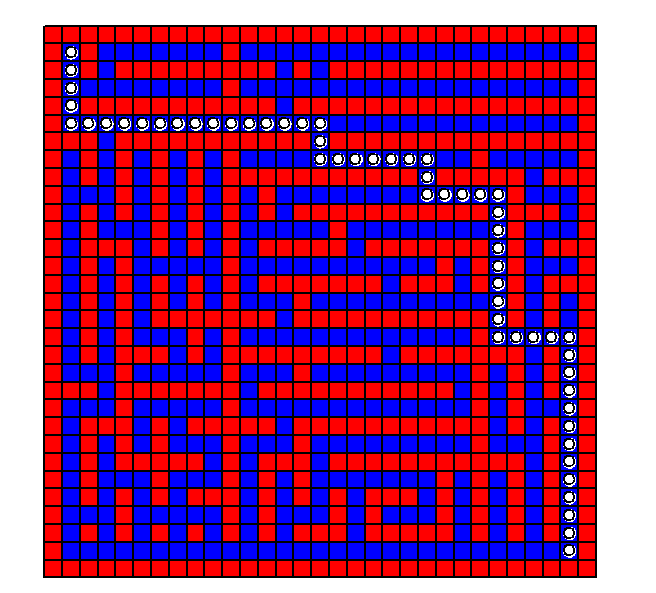

## 生成迷宫

随机生成一个可走通的迷宫，绘制出迷宫和正确的路径

## 主流算法

- 深度递归
1. 先将地图初始化为一个个孤点（即任意两个方块之间的墙都是封闭的）
2. 将起点作为正在访问的方块
3. 如果四周存在邻居方块没有被访问过，随机选择一个没有被访问过的邻居方块，将它们之间的墙打通，并且移动到该方块上
4. 重复第3步，如果四周所有方块都被访问过，则返回之前访问的方块，直到找到一个之前访问的点存在邻居方块没有被访问过
5. 当不存在这样的方块时结束

- prim随机算法
1. 先将地图初始化为一个个孤点（即任意两个方块之间的墙都是封闭的）
2. 选一个方块作为迷宫的通路，然后把它四周的墙放入列表
3. 当列表里还有墙时，从列表里随机选一个墙
4. 如果这面墙分隔的两个方块只有一个方块被访问过（即另一个方块不是连通的）, 就把墙打通，同时把另一个方块四周的墙加入列表；
5. 墙两面的单元格都已经被访问过，那就从列表里移除这面墙
6. 重复3、4、5步

- 递归切割算法
1. 先将地图初始化为全部连通（即没有墙）
2. 随机选取一行和一列全部封上墙，此时，地图被分为不连通的四个小地图，在十字形的墙上随机选三条边各开一道门，保证四个小地图连通
3. 对四个小地图递归执行第2步
4. 当小地图行数和列数不足以分割时结束

代码使用的是第三种算法

